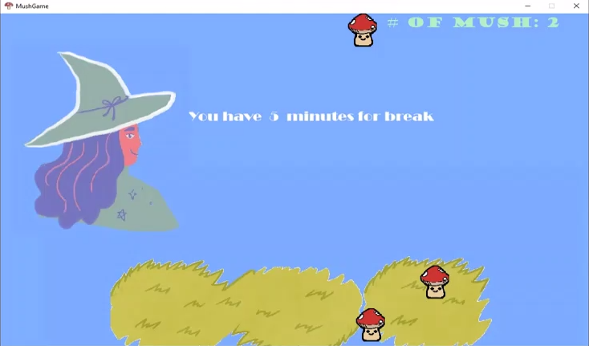
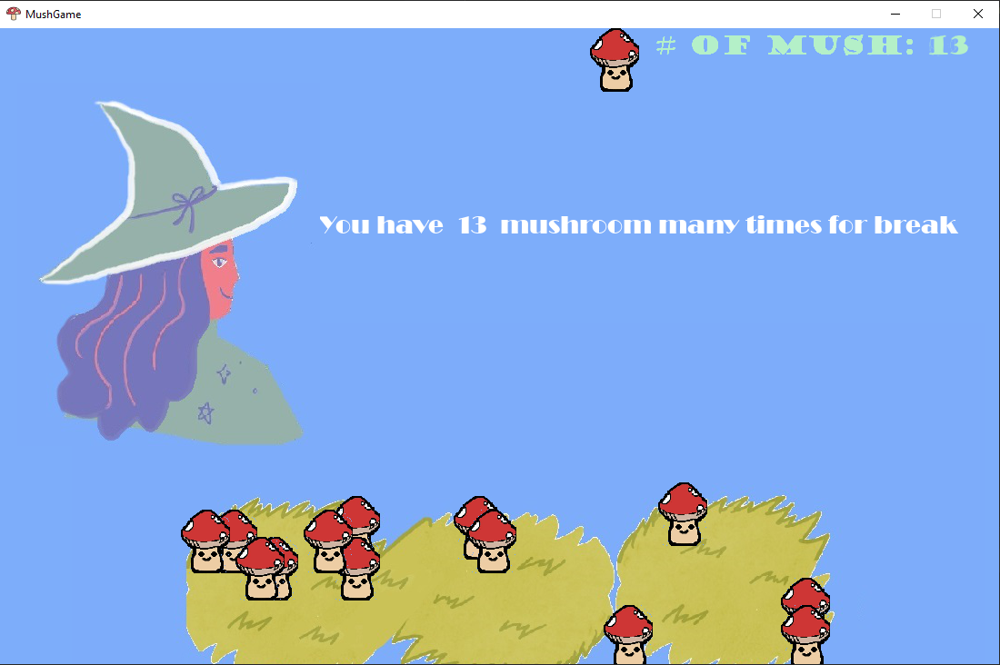

# Mush

### Mushroom game for classroom environment to foster children's attention during the class time.

</img> </img> </img> 

classroom analytics collaborative game that encourages positive behaviour. Simply, Mush is a game that analyses environmental volume: If environment is not very loud (if it does not exceed the threshold volume value) mushrooms are growing during the session. 
</img>

This concept is adapted into a classroom environment. If a group of students are not very laudy during the class session mushrooms grow. 

Students are awarded with the breaktime : 
  students can take a break as long as the amount of mushrooms they grow.
  
  For volume measurement rcaudio (https://github.com/mhy12345/rcaudio) is used.
  
  For game part pygame library is used.
  
##  Game object's definition 
  
### Mage
</img>

Mage comes at the end of the all sessions (at the end of the class) And she announces the awarded breaktime.

There are two cases:

1st Case:
    
If student could grow less than 5 mushrooms they are awarded 5 minutes break:

</img>

2nd Case:
    
If student could grow more than 5 mushrooms they are awarded with mushrooms many minutes break:
In this case students grow 13 mushrooms and they are awarded with 13 minutes break

</img>

### Mushrooms

Mushrooms are grown since the measured total volume during a session is not exceeded the threshold value. In this case: They keep appearing until the end of the class

If the measured total volume during a session is exceeded the treshold value, mushrooms are stop appearing.

https://www.youtube.com/watch?v=-tU486wmFCQ
